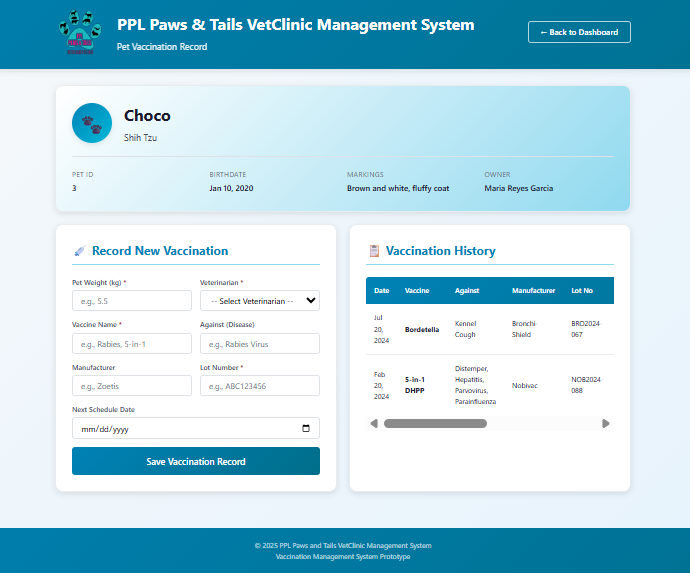
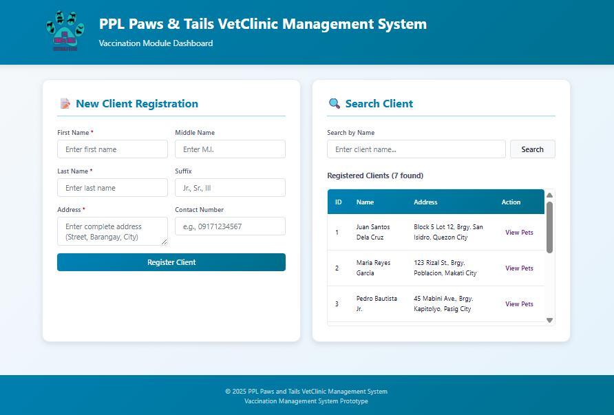

# PPL Paws & Tails Veterinary Clinic Management System

A web-based Veterinary Clinic Management System focused on **pet vaccination record management**. Built with PHP and Oracle Database 21c Express Edition.

> **Finals Project for Information Management**

---

## Prototype Overview

This prototype demonstrates a vaccination recording system for veterinary clinics. While the full-featured vet clinic system described in the academic paper covers comprehensive clinic operations, this prototype specifically focuses on:

- **Client Management** - Register and search pet owners
- **Pet Registration** - Add pets with breed, birthdate, and markings
- **Vaccination Records** - Track vaccinations, manufacturers, lot numbers, and schedules
- **Visit Tracking** - Record clinic visits with pet weight and assigned veterinarian
- **Payment Processing** - Log payments with multiple payment methods (Cash, GCash, Credit/Debit Card)

### Screenshots

#### Home Dashboard - Client Search


#### Pet Record - Vaccination Details


---

## Prerequisites

Before running this project, ensure you have the following installed:

| Requirement | Version | Notes |
|-------------|---------|-------|
| **PHP** | 8.0+ | With OCI8 extension enabled |
| **Oracle Database** | 21c XE | Express Edition (free) |
| **Oracle Instant Client** | 21.x | Required for PHP OCI8 |
| **Git** | Latest | For cloning the repository |

---

## Installation

### Step 1: Clone the Repository

```bash
git clone https://github.com/Jeyep18/VetClinicSystem.git
cd VetClinicSystem
```

### Step 2: Install Oracle Database 21c Express Edition

1. Download Oracle Database 21c XE from [Oracle's official website](https://www.oracle.com/database/technologies/xe-downloads.html)
2. Run the installer and follow the setup wizard
3. **Remember the password** you set for the `SYS` and `SYSTEM` accounts
4. Ensure the Oracle services are running:
   - `OracleServiceXE`
   - `OracleOraDB21Home1TNSListener`

### Step 3: Install Oracle Instant Client

1. Download Oracle Instant Client from [Oracle Instant Client Downloads](https://www.oracle.com/database/technologies/instant-client/winx64-64-downloads.html)
2. Extract to a folder (e.g., `C:\instantclient_21_x`)
3. Add the path to your **System Environment Variables** `PATH`
4. **Restart your terminal/IDE** after updating PATH

### Step 4: Enable PHP OCI8 Extension

1. Locate your `php.ini` file:
   ```bash
   php --ini
   ```

2. Uncomment or add the OCI8 extension:
   ```ini
   extension=oci8_19  ; Use this for PHP 8.x with Oracle 21c
   ```

3. Verify the extension is loaded:
   ```bash
   php -m | findstr oci8
   ```

### Step 5: Create Database User

Open SQL*Plus as SYSDBA and create the application user:

```sql
sqlplus sys/yourpassword@localhost/XE as sysdba
```

> **Note**: Replace yourpassword with the password you set for the `SYS` and `SYSTEM` accounts.

```sql
-- Create user with quota
CREATE USER vet_db IDENTIFIED BY vetclinic
DEFAULT TABLESPACE users
QUOTA UNLIMITED ON users;

-- Grant necessary privileges
GRANT CONNECT, RESOURCE TO vet_db;
GRANT CREATE SESSION, CREATE TABLE, CREATE SEQUENCE, CREATE TRIGGER TO vet_db;

EXIT;
```

### Step 6: Initialize Database Schema

Connect as `vet_db` and run the schema file:

```sql
sqlplus vet_db/vetclinic@localhost/XE
```

```sql
@"c:\path\to\VetClinicSystem\oracledb\schema.sql"
```

> **Note**: Replace the path with your actual project location.

---

## Running the Application

### Start the PHP Development Server

Navigate to the project directory and run:

```bash
cd VetClinicSystem
php -S localhost:8080
```

### Access the Application

Open your browser and navigate to:
- **Main Dashboard**: http://localhost:8080/index.php
- **Connection Test**: http://localhost:8080/test_connection.php

---

## Troubleshooting

### Common Oracle Errors

#### ORA-12514: TNS:listener does not currently know of service requested

**Cause**: The service name is incorrect or the database is not registered with the listener.

**Solution**:
1. Open SQL*Plus and check available services:
   ```sql
   sqlplus sys/yourpassword@localhost/XE as sysdba
   SELECT NAME FROM v$services;
   ```

2. If using a Pluggable Database (PDB), you may need to use `XEPDB1` instead of `XE`:
   ```php
   // In db_connect.php, try changing:
   define('DB_CONNECTION', 'localhost/XE');
   // To:
   define('DB_CONNECTION', 'localhost/XEPDB1');
   ```

3. Restart the Oracle listener:
   ```cmd
   lsnrctl stop
   lsnrctl start
   ```

---

#### ORA-12541: TNS:no listener

**Cause**: The Oracle TNS Listener service is not running.

**Solution**:
1. Open Windows Services (`services.msc`)
2. Find `OracleOraDB21Home1TNSListener`
3. Right-click → **Start**
4. Set startup type to **Automatic**

Alternatively, start via command line:
```cmd
lsnrctl start
```

---

#### ORA-12560: TNS:protocol adapter error

**Cause**: Oracle Database service is not running.

**Solution**:
1. Open Windows Services (`services.msc`)
2. Find `OracleServiceXE`
3. Right-click → **Start**
4. Set startup type to **Automatic**

---

#### ORA-01017: invalid username/password; logon denied

**Cause**: Incorrect credentials in `db_connect.php`.

**Solution**:
1. Verify credentials in `db_connect.php`:
   ```php
   define('DB_USERNAME', 'vet_db');     
   define('DB_PASSWORD', 'vetclinic');     
   define('DB_CONNECTION', 'localhost/XE');
   ```

2. Test login manually:
   ```cmd
   sqlplus vet_db/vetclinic@localhost/XE
   ```

---

#### OCI8 Extension Not Loaded

**Cause**: PHP OCI8 extension is not enabled or Instant Client path is not set.

**Solution**:
1. Ensure `extension=oci8_19` is uncommented in `php.ini`
2. Verify Instant Client is in your PATH:
   ```cmd
   echo %PATH%
   ```
3. Restart PHP/Apache after changes
4. Run the test page: http://localhost:8080/test_connection.php

---

### Verifying Connection

Always use the built-in connection test page to diagnose issues:

```
http://localhost:8080/test_connection.php
```

This page will show:
- PHP version
- OCI8 extension status
- Oracle connection status
- Sample query results (if connected)
- Specific error codes with solutions

---

## Project Structure

```
VetClinicSystem/
├── index.php              # Main dashboard - client search & display
├── add_pet.php            # Add new pet form
├── pet_record.php         # View/edit pet records & vaccinations
├── db_connect.php         # Database connection & helper functions
├── test_connection.php    # Connection diagnostic tool
├── style.css              # Application styles
├── assets/
│   └── Logo.svg           # Application logo
└── oracledb/
    ├── schema.sql         # Complete schema with mock data
    ├── create_table.sql   # Table creation scripts (unused)
    └── insert_table.sql   # Data insertion scripts (unused)
```

---

## Database Schema

The system uses the following tables:

| Table | Description |
|-------|-------------|
| `CLIENT` | Pet owner information |
| `CLIENT_CONTACT` | Client phone numbers |
| `PET` | Pet details (name, breed, birthdate) |
| `VETERINARIAN` | Vet staff information |
| `VETERINARIAN_CONTACT` | Vet contact numbers |
| `VISIT_RECORD` | Clinic visit logs |
| `VACCINATION` | Vaccination records |
| `PAYMENT` | Payment transactions |

---

## Important Notes

- **Oracle 21c XE vs 10g XE**: This prototype uses Oracle 21c Express Edition, which has some syntax differences from Oracle 10g mentioned in the original paper
- **Prototype Scope**: This implementation focuses on the vaccination recording functionality; a full vet clinic system would include additional features like appointments, inventory, and medical records
- **Development Server**: The PHP built-in server (`php -S`) is for development only.

---

## License

This project is for the requirements of Information Management Course in Ateneo de Naga University.
